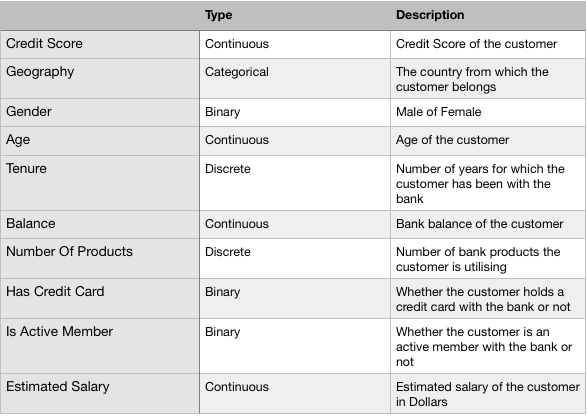

```{r setup, include=FALSE}
knitr::opts_chunk$set(echo = FALSE,message=FALSE,warning=FALSE)
```

## Introduction

Logistic regression is a very famous and widely applied technique in supervised learning. It is usually used to perform predictive analysis when the response variable is binary. 

Logistic regression can also be approached by Bayesian modeling. In general, Bayesian analysis is more flexible, and it is proved to be superior for small samples. For Bayesian modeling, it can incorporate prior information. For example, if we want to know exactly which factors are most effective on the response, we can use shrinkage prior to implement variable selection. 

In practice, predicting the exit status (binary: 0 or 1) of customers of a bank can be an application of the standard logistic regression as well as Bayesian approach. In this report, we delve into a data set about account status of a bank in three European countries. The objective is to predict if the clients will leave the bank based on part of their information, such as geography, gender and account balances, etc. In this process, we will also explore the different effects of specific predictors to response variable in different models. 

## Data Exploration

The data set we use for this report is from Kaggle website. It has 10000 observations and 11 variables. The table below shows their names, types and descriptions. This data set has 6 numeric predictors and 4 categorical variables.
 
 table 1: predictors and short descriptions
 
 <center>
{width=72%}
</center>

The additional figure also shows the overall distribution of the binary response (Exited status). From the figure, we could find that a large proportion of clients keep their bank accounts, that number of exited status=0 is almost four times of number of clients who left the bank.

 figure1: response

In next step, we explore the relationship between predictors and the response variable. Bar plots of categorical predictors against response and pairwise plots as well as summary tables are displayed. We could gain a general knowledge of distributions for every categorical or numeric variable.

 table2 figure2: categorical predictors summary and bar plots
 
 table3 figure3, 4: quantitative predictors summary, box plot and hist, correlation

```{r}
library(tidyr); library(MCMCpack); library(coda); library(EBglmnet); library(GGally); library(ggplot2)
c = read.csv("Churn_Modelling.csv")[,-c(1:3)]
c$Geography = as.factor(c$Geography)
c$Gender = as.factor(c$Gender)
c$HasCrCard = as.factor(c$HasCrCard)
c$IsActiveMember = as.factor(c$IsActiveMember)
c$Exited = as.factor(c$Exited)
```

```{r}
c_pairs=ggpairs(c[c(1,4,5,6,7,10)],axisLabels = "none",
        upper = list(continuous = "points", combo = "dot"),
        lower = list(continuous = "cor", combo = "dot"),
        diag = list(continuous = "barDiag"),
        title='Figure 1. Pairwise scatterplots and histogram of numeric variables.') + 
  theme_bw()
c_pairs
```

```{r}
library(gbm)
p1=ggplot(c, aes(x=Geography,y=Exited,color=Geography)) +
  geom_boxplot(outlier.colour="black", outlier.shape=16,outlier.size=2, notch=FALSE)+
  ggtitle("Boxplot of Geography")+
  scale_color_manual(values=c("#999999", "#E69F00", "#56B4E9"))
p2=ggplot(c, aes(x=Gender,y=Exited,color=Gender)) +
  geom_boxplot(outlier.colour="black", outlier.shape=16,outlier.size=2, notch=FALSE)+
  ggtitle("Boxplot of Gender")+
  scale_color_manual(values=c("#999999", "#E69F00", "#56B4E9"))
p3=ggplot(c, aes(x=HasCrCard,y=Exited,color=HasCrCard)) +
  geom_boxplot(outlier.colour="black", outlier.shape=16,outlier.size=2, notch=FALSE)+
  ggtitle("Boxplot of HasCrCard")+
  scale_color_manual(values=c("#999999", "#E69F00", "#56B4E9"))
p4=ggplot(c, aes(x=IsActiveMember,y=Exited,color=IsActiveMember)) +
  geom_boxplot(outlier.colour="black", outlier.shape=16,outlier.size=2, notch=FALSE)+
  ggtitle("Boxplot of IsActiveMember")+
  scale_color_manual(values=c("#999999", "#E69F00", "#56B4E9"))
grid.arrange(p1, p2, p3,p4,nrow = 2)
```

## Logistic Regression Model

In this part, we will briefly introduce three logistic regression models, including standard one and two Bayesian models. In addition to the most significant reason that our response variable is binary, there are several advantages of logistic regression against other methods.  First, it can be interpreted more easily comapred with some complex models, while holding the same level of prediction precision. It helps to explain the relationship between the predictors and response variable. Next, the logistic regression can also handle mixed types of exploratory variables. Finally, logistic regression is an informative method that it provides both the size and
the direction of the effects of its predictors.

### Logistic Regression

The basic assumption of standard logistic regression model is that the observations $y_1, ..., y_n$ are independent and following binomial distribution (1, $p_i$), where $p_i$ is the probability of response $y_i=1$. We could estimate the parameters $\beta$ ,which maximize $\Pi_{i=1}^n P(Y_i=y_i)$ using log-maximum likelihood approach. The statistical description is below:

\[y_i\sim \textup{ Binomial }(1, p_i)\]
\[\log(\frac{p_i}{1-p_i})=x_i^T\beta\]

\[p(y_i;\beta)=(p_i)^{y_i}(1-p_i)^{1-y_i}\]


\[p(y_1,...,y_n;\beta)=\prod_{i=1}^n(p_i)^{y_i}(1-p_i)^{1-y_i}\]
Among them, $x_i$ is the i-th row of observation and $\beta$ are parameters.

### Bayesian Logistic Regression

In the standard logistic regression above, we treat $\beta$ as a column of unknown but fixed parameters. Actually, $\beta$ could be seen as a vector of random variables from the prospective of Bayesian analysis. 
That is the preliminary thought of Bayesian analysis. In this case, we use data (model) and prior we have to estimate the posterior distribution of parameters. Basic Bayesian logistic regression method assumes that $\beta$ follows a multivariate normal prior distribution . 

\[\textup{model: } y_i\sim \textup{ Binomial }(1, p_i)\]
\[\log(\frac{p}{1-p})=X^T\beta\]
\[\textup{prior: } \beta\sim N(\mathbf{\mu,\Sigma} )\]

where $\mu$ is the mean vector of $\beta$ and $\Sigma$ is a covariance matrix.

### Bayesian Logistic Regression with LASSO prior

To figure out the most important predictors to the exited status response and to improve the prediction precision, we could use LASSO prior to the fit a logistic model with original data. With fewer predictors 
left, LASSO prior also adds to interpretation of our final model.

\[\textup{model: } y_i\sim \textup{ Binomial }(1, p_i)\]
\[\log(\frac{p}{1-p})=X^T\beta\]
\[\textup{prior: } \beta_i\sim N(0,\sigma_i^2)\]
\[\textup{hyper prior: } P(\sigma_i^2) \sim Exponential(\lambda)\]

where $\lambda$ is a fixed real number.

In LASSO logistic regression model, we first set a hypothesis that the solution is sparse that only a few of parameters $\beta$ are not zero and do not have significant contributions to response $y$. So the prior use a heavy-tailed exponential distribution for variances of parameters, which means variances $\sigma^2$ peak 
around 0 and have a high probability to equal or approximate 0. If $\sigma^2$ is small enough, we could assign
0 to associated parameters. That is the mechanism of shrinkage prior like LASSO. 

In conclusion, Bayesian logistic regression with LASSO prior is a hierarchical model with normal prior.
The hyper prior variances follows an exponential distribution with parameter $\lambda$, which controls the local shrinkage speed of paramters to 0.


## Example: Data/Fitting Models

In this part, we are going to fit the standard logistic regression model, Bayesian logistic regression model as well as Bayesian logistic regression model with LASSO prior. We will estimate the probability of clients who close their bank accounts and make predictions of YES or No based estiamted parameters. In addition, we could also do Bayesian inferences from posterior samples we obtain using Bayesian method.

In order to make judgements on the effectiveness of several models, we first split the whole dataset into training partition and test partition randomly at the proportion of 3:1. Then the same training data set is
going to be used for fitting models and remaining test data set will be used to make predictions.

```{r}
# Split into training & test sets
C = model.matrix(Exited~., data=c)
set.seed(3)
ind = sample(1:10000, 7500, replace=F)
Xtrain = C[ind,]
Xtest = C[-ind,]
ytrain = c[ind,11]
ytest = c[-ind,11]
```


Standard logistic regression could be easily fitted by using a very common function `glm` in `stats` package.
Printing out the summary table, we get a model like:
```{r}
### Logistic Regression
res_original = glm(ytrain~., data=as.data.frame(Xtrain[,-1]), family=binomial(link="logit"))
summary(res_original)
### prediction of Standard logistic regression
p1 = summary(res_original)$coefficients[,4]
beta1 = res_original$coefficients
name = names(beta1)
predtest1 = 1*(predict(res_original, newdata=as.data.frame(Xtest[,-1]), type="response")>=0.5)
table(ytest, predtest1)
### right rate
pred1 = mean(predtest1==ytest)
```

Intepretation of parameters will be showed in next part together with other two models.

Monte Carlo Markov Chain is an extremely effective way to sample from posterior distribution in Bayesian 
analysis system. In this problem, we then use MCMC method to obtain the posterior distribution of $\beta$ parameters from normal prior. Here `MCMClogit` function in `MCMCpack` package could be a good choice for us.

This function runs 11000 default iterations, starting with mean 0 and precision matrix of $0.01\textbf{I}$ under a multivariate normal prior. Discarding first 1000 iterarions, we save the big c(10000,12) posterior matrix into
an object `res_mcmc`.
```{r}
## Bayesian logistic
res_mcmc = MCMClogit(ytrain~Xtrain[,-1], b0 = 0, B0 = 0.01)
beta2_sd = sapply(1:(dim(res_mcmc)[2]), function(i) {sd(res_mcmc[,i])})
beta2_mean = colMeans(res_mcmc)
p2 = 2*(1-pnorm(abs(beta2_mean/beta2_sd)))
prob2 = rowMeans(1/(1+exp(-Xtest %*% t(res_mcmc))))
predtest2 = 1*(prob2>=0.5)
pred2 = mean(ytest==predtest2)
table(ytest, predtest2)
```

Bayesian logistic regression with LASSO prior is a more complex hierarchical model compared with previous
ones. We need to sample from the joint posterior formula of $\beta,\sigma^2$, and $\lambda$ is a fixed but unknow paramter that we need to eatimate first. So we first use cross-validation to select the optimal $\lambda$ which may minimize cross-validation error. By specifying $\lambda$, we fit a hierarchical Bayesian model to make references on test data. It is usually a little hard or tedious to realize the sampling process without cojugate priors. In terms of our knowledge, we could use another powerful tool Rstan to do Hamilton Monte Carlo sampling. See Appendix for Rstan script. we could also use a function contributed by other R users called `EBglmnet` to acheive the same objective, which is much concise. First, we use `cv.EBglmnet` function to select the optimal model. In last step using `EBglmnet` to sample from the established model. See references below to get more information about this fucntion.


### to be continue

```{r}
## Bayesian logistic regression model with LASSO prior: cv used to select model, 
set.seed(3)
res_lassocv = cv.EBglmnet(Xtrain[,-1], ytrain, family="binomial", prior="lasso")
res_lasso = EBglmnet(Xtrain[,-1], ytrain, family="binomial", prior="lasso", hyperparameters = 8.201102e-05)
beta3 = c(res_lasso$Intercept, rep(0,11))
for(i in 1:nrow(res_lasso$fit)){
  beta3[res_lasso$fit[i,1]+1] = res_lasso$fit[i,3]
}
pred3 = 1*(1/(1+exp(-Xtest %*% beta3))>=0.5)
mean(ytest==pred3)
table(ytest, pred3)
```

```{r}
# Histogram 
par(mfrow=c(3,4))
for(i in 1:12){
  hist(res_mcmc[,i], 
       main=sprintf("Posterior of beta %s", name[i]), 
       xlab=sprintf("%s", name[i]))
  abline(v=beta1[i], col="red")
}
```

```{r}
# CI plot
ci2 = data.frame(summary(res_mcmc)$quantiles, name=name, mean=beta2_mean)
colnames(ci2) = c("lower","quartile1","median","quartile3","upper","name","mean")
ci2[-1,] %>% # if exclude intercept
  ggplot( aes(x=name, y=mean) ) + 
  geom_point() +
  geom_point( aes(x=name, y=beta1[-1]), col="blue" ) +
  geom_errorbar( aes(ymin=lower, ymax=upper) ) +
  coord_flip() +
  theme_bw() + 
  ylab("beta") +
  xlab("")
ci2 %>% # if include intercept
  ggplot( aes(x=name, y=mean) ) + 
  geom_point() +
  geom_point( aes(x=name, y=beta1), col="blue" ) +
  geom_errorbar( aes(ymin=lower, ymax=upper) ) +
  coord_flip() +
  theme_bw() + 
  ylab("beta") +
  xlab("")
```

```{r}
# Correlation of beta
crosscorr.plot(res_mcmc)
```

```{r}
# p-values
p = data.frame(p1=p1, p2=p2)
knitr::kable(p, align="c")
```

## Inference and Prediction

## Conclusion

## References

Wei, R., and Ghosal, S. (2017). Contraction properties of shrinkage priors in logistic regression, Preprint at http://www4.stat.ncsu.edu/~ghoshal/papers.

Genkin, A., Lewis, D. and Madigan, D. (2007). Large-scale Bayesian logistic regression for text categorization, \textit{Technometrics} \textbf{49}(3): 291–304.

Kapat, P., and Wang K. (2006). Classification Using Bayesian Logistic Regression: Diabetes in Pima Indian Women Example. Ohio State University, OH. https://www.asc.ohio-state.edu/goel.1/STAT825/PROJECTS/KapatWang_Team4Report.pdf

Anhui Huang and Dianting Liu (2016). EBglmnet: Empirical Bayesian Lasso and Elastic Net Methods for Generalized Linear Models. R package version 4.1. https://CRAN.R-project.org/package=EBglmnet

Andrew D. Martin, Kevin M. Quinn, Jong Hee Park (2011). MCMCpack: Markov Chain Monte Carlo in R. Journal of Statistical Software. 42(9): 1-21. URL http://www.jstatsoft.org/v42/i09/.

Li, L & Yao, W. (2017). Fully Bayesian logistic regression with hyper-LASSO priors for high-dimensional feature selection. Statistics 88, 1-25.


