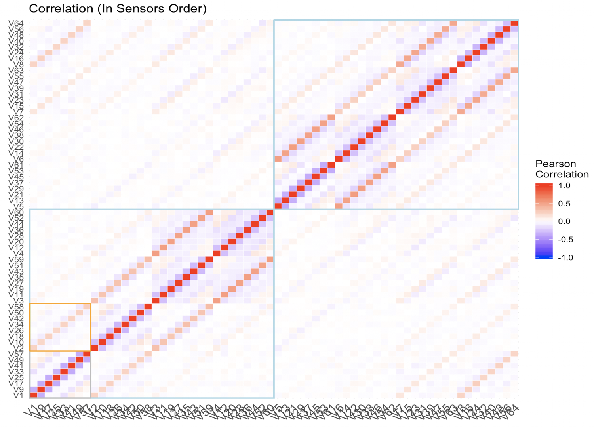

```{r setup, include=FALSE}
knitr::opts_chunk$set(echo = FALSE, message=FALSE, warning = FALSE, fig.align='center')
```

## 1. Introduction and Motivation

Artificial Intelligence is extremely popular in our new technology age. It is widely applied in every aspect of our daily life, such as business, industry and healthcare. Combining artificial intelligence and machine learning techniques, our project is going to delve into a dataset which collected 8 consecutive readings from 8 human arm muscle sensors (64 independent variables in total) to predict associated gestures for an artificial arm. 

The dataset has 11678 observations of human arm muscle activity corresponding to four different hand gestures from a prosthetic control system. It has four classes of motions which are "rock", "scissors", "paper" and "ok" as the response variable. Description of variables is shown in Table 1. In this dataset, `gestures`, i.e., the `V65`, is our response variable. The variables `V1` to `V8` are related to the first reading of 8 sensors, `V9` to `V16` are related to the second reading of 8 sensors, etc. All predictors are continuous variables. 

Our essential motivation for this project is to predict the `gestures` as accurately as possible. We want to fit the data with various classification methods including logistic regression, LDA, QDA, KNN, SVM, classification tree and random forest, and find the one that has the best prediction performance. Although the sample size is large, some classification methods such as KNN and QDA, are not suitable for a large number of predictors. So before model selection, we also want to reduce the dimension of predictors. To achieve this effect, we consider two possible methods, PCA and variable selection. Additionally, we want to know the important predictors for the 4 gestures. 


```{r}
## Table 1
t1=data.frame(name=c("V65","V1-V8","V9-V16","V17-V24","V25-V32","V33-V40","V41-V48","V49-V56","V57-V64"),
              type=c("categorical",rep("continuous",8)),des=c("Response (rock:0, scissors:1, paper:2, ok:3)",paste0("Reading ",1:8," Sensor 1-8")))
cap="Data Description"
knitr::kable(t1,format='pandoc',caption=cap,align='l',
             col.names=c('Variables names','Type','Description'))
```

## 2. Data Exploration

```{r}
## Read the Data
dat0 = read.csv("0.csv", header = F)
dat1 = read.csv("1.csv", header = F)
dat2 = read.csv("2.csv", header = F)
dat3 = read.csv("3.csv", header = F)
g = rbind(dat0, dat1, dat2, dat3)
g$V65=as.factor(g$V65)
```

```{r}
## Libraries
library(ggplot2);library(GGally);library(gbm);library(reshape2);library(gplots)
library(dplyr);library(e1071);library(tree);library(class);library(MASS);
library(nnet);library(randomForest);library(foreign);
```


### 2.1 Individual Variables

To have an intuitive sense of the dataset, first we can have a look at the barchart of the response variable `gesture`, which is on the left side of the Figure 1. We see that the `gesture` is extremely balanced, as each category of the response variable has around 2900 observations. It is good for following analysis, especially for prediction. Next, we want to know more about the independent variables. We find that the individual distributions of all 64 predictors are quite similar, so we can only take the first 8 variables `V1`-`V8` as an example, which are the first reading of 8 sensors. Table 2 is the summary table of `V1`-`V8`. Based on it, we can find that there are some extreme values for `V1`-`V8`. To be more intuitive, we can also view each predictor from boxplot. Take `V1` as an example and see the right side boxplot in Figure 1, we notice that the distribution of `V1` is heavy-tailed. Combined with the numeric summaries of the predictor variables in Table 2 (note that we only show part of it), all the predictors are focused around 0 and have long symmetric tails. 

```{r,out.width='49%',fig.cap="Barchart of Gestures and Boxplot of V1",fig.show='hold',fig.pos="H",out.height='60%'}
# Response barchart & Scatterplot
knitr::include_graphics(c("response.png","boxplot1.png"))
```

```{r}
## Table 2: Summary
summary_col = function(x) 
  {c(unname(quantile(x,c(0,0.25,0.5))),mean(x),unname(quantile(x,c(0.75,1))))}
t2=data.frame(Summary=c("Min.","1st Qu.","Median","Mean","3rd Qu.","Max."),
              V1=summary_col(g[,1]),V2=summary_col(g[,2]),
              V3=summary_col(g[,3]),V4=summary_col(g[,4]),
              V5=summary_col(g[,5]),V6=summary_col(g[,6]),
              V7=summary_col(g[,7]),V8=summary_col(g[,8]))
cap="Numerical Summaries (only part is shown)"
knitr::kable(t2,format='pandoc',caption=cap,align='l',digits = 2)
```

### 2.2 Correlation Between Predictors

Then, we want to explore the relationship between predictors. The left plot in Figure 2 is the correlation matrix of all 64 predictors. We find some interesting structure in this correlation matrix. To be more clearly, we can zoom in and only focus on the first 16 varaibles, that is, `V1`-`V16`, which is shown on the right side of Figure 2. The grey boxes represent correlation matrix within the same reading. The small blue boxes are negative correlations between adjacent readings of the same sensor. And the small red boxes are the positive correlations between adjacent sensors of the same reading. To see exact correlations between sensors, we also rearrange the correlation matrix in the order of sensors, which is shown in Figure 3. So in this correlation matrix, the first 8 variables are the 8 readings for the first sensor, the next 8 ones are the readings for the second sensor, etc. The reordered correlation matrix reconfirms our conclusions before. The orange box also shows that the same reading of the first and second sensors are positively correlated. Based on this correlation matrix, we can also view that the first 4 sensors are almost uncorrelated to the last 4 sensors. The results of correlation matrix make sense, as we expect that activities of nearby muscle or consecutive time have some similarities. 

```{r,out.width='49%',fig.cap="Correlation Plots",fig.show='hold',fig.align='center',fig.pos="H",,out.height='60%'}
# Correlation plots
knitr::include_graphics(c("correlation_overview","correlation1.png"))
```

```{r,out.width='49%',fig.cap="Correlation Plots",fig.show='hold',fig.align='center',fig.pos="H",,out.height='60%'}
# Correlation plots

```

### 2.3 Relationship with Response

Next, we explore the relationship between predictors and the response. Using the density plots in Figure 4, we address the different significance of each predictor variable in prediction for gesture. For example, the densities of sensor 1 in reading 1 for 4 gesture classes were quite similar, while the densities of sensor 7 in reading 1 were quite different. In this case, the sensor 7 should be put on more weights for prediction than the sensor 1. The importance diversity encouraged us to do variable selection to reduce dimensions. 

```{r,out.width='49%',fig.cap="Density Plots",fig.show='hold',fig.pos="H",,out.height='60%'}
# Histograms of reading 1 of sensor 1 and sensor 7
knitr::include_graphics(c("r1sensor1.png","r1sensor7.png"))
```

To visualize the data more comprehensively, we can look at the scatterplot and contour of density of `V2` and `V7` in Figure 5. The joint distributions of `V2` and `V7` look like normal with unequal variances for different gestures. Based on this plot, we expect that the decision boundary between the classes is non-linear and QDA may perform well on this dataset. 


```{r,out.width='49%',out.height='60%',fig.cap="Scatterplot and Contour of V2 and V7",fig.show='hold',fig.pos="H"}
# Contour of density
knitr::include_graphics(c("scatterplot.png","contour.png"))
```

### 2.4 PCA

Look at the pairwise scatterplot of `V2` and `V7` in Figure 5, it seems that `V2` and `V7` have no obvious pairwise structure. As no specific pattern is detected, PCA won't be a good way to reduce dimension. We try PCA and find that the first 35 principal components merely cover 80% of the variance which means that the effect of this dimension reduction method to this dataset is terrible.

### 2.5 Variable Selection

As mentioned before, we have 64 predictor variables and some are more important than others. Therefore, we try two methods to do variable selection to reduce redundance and better the prediction performance and interpretability. 

The first method is to use random forest with mtry=8 to fit the whole dataset and check the importance of the variables. We find that the last but one sensor in each reading is most important and the second sensor in each reading is next most important, which can be seen in Figure 5. 

The second method is to utilize stepwise forward selection based on AIC and BIC values to choose the corresponding optimal logistic regression models respectively and find the important variables. The important variables found in this method are basically the same as the ones we find before using random forest. 

Finally we separately check the overall prediction accuracy using 8 predictors, i.e., the 7th sensors in 8 readings, and the accuracy using 16 predictors, i.e., the 7th and 2nd sensors in 8 readings. And we reach the conclusion that the latter one have overall better performance than the former one. Thus, we finally decide to carry on the remaining analysis with 16 important predictors.

```{r,fig.cap="The Importance of the Variables",fig.pos="H",,out.height='60%'}
# The Importance of the Variables
## Perform Variable Selection
## by random forest and check the importance of variables
#set.seed(77)
#rf=randomForest(V65~.,data=g,mtry=8,importance=TRUE)
#varImpPlot(rf)
knitr::include_graphics(c("VarImport.png"))
```

```{r}
## Variable Selection by stepwise logistic regression based on AIC/BIC


#min.model = multinom(V65~1, data=g[train,])
#biggest = multinom(V65~., data=g[train,])
#fwd1.model = step(min.model, scope=formula(biggest), direction="forward")
#summary(fwd1.model)
#pred_lr1 = predict(fwd1.model, g[-train,])
#mean(pred_lr1 == g[-train,65])
#fwd2.model = step(min.model, scope=formula(biggest), direction="forward", k=log(length(train)))
#summary(fwd2.model)
```

## 3. Classification Methods

In this part, we are about to fit various classification models to the data using 16 significant variables selected by random forest. In order to compare their prediction performance, we first randomly split the dataset into training and testing parts at a ratio about 8:2. Classification models are built on training data set and test set is used to evaluate their prediction accuracy. 

```{r}
## Split the dataset into training and test sets
set.seed(77)
g_new=g[,c(seq(from=2,to=58,by=8),seq(from=7,to=63,by=8),65)]
train=sample(1:nrow(g_new),size=nrow(g_new)*0.8,replace=FALSE)
```

In order to verify our guess above that our decision boundary is non-linear, we first try two linear models, i.e., linear multinomial logistic regression and LDA, as both multinomial logistic regression and LDA are powerful models we usually used in machine learning when decision boundary is approximately linear. Multinomial logistic regression is a generalization of original logistic regression when the response has multiple classes. And LDA assumes data of each class follows a normal distribution with identical variance.

Based on the fitted models, the prediction accuracy of multinomial logistic regression and LDA on test data set are only 34.5% and 34.8% respectively, which are quite disappointing for this dataset. But we could not simply conclude our decison boundary to be non-linear this time, we are encouraged to try non-linear version models of multinomial logistic regression and LDA in the next step. If these models show great improvement regarding prediction performance, we could confirm our initial guess and try other flexible models.


### 3.1 Quadratic discriminant analysis (QDA)

QDA is a more flexible discriminant method based on LDA. Comapred to LDA, QDA relaxes the limitation of the same variance of normal distribution. Therefore, QDA could be applied to more scenarios and larger range of datasets. In this step, we first fit QDA classifiers on this dataset and then discuss about our prediction result together with multinomial logistic regression.

```{r}
## LDA
lda_fit = lda(V65~., data=g_new[train,])
lda_pred = predict(lda_fit, g_new[-train,])$class
accuracy_lda = mean(lda_pred == g_new[-train,'V65'])
```

```{r}
## QDA
qda_fit = qda(V65~., data = g_new[train,])
qda_pred = predict(qda_fit, g_new[-train,])$class
accuracy_qda = mean(qda_pred==g_new[-train,'V65'])
```

### 3.2 Multinomial Logistic Regression with Quadratic Terms (LR)

As logistic regression models could only produce linear decision boundary, we add quadratic terms of each predictor into the original model to generalize it. The modified model is more complicated and could generate complex boundaries to meet our need. We fit a multinomial logistic regression included quadratic terms to make prediction below. 

```{r, message=FALSE}
## Multinomial Logistic Regression
set.seed(3)
lr_fit1 = multinom(V65~., data=g_new[train,], trace=FALSE)
lr_fit2 = multinom(V65~poly(V2,2)+poly(V10,2)+poly(V18,2)+poly(V26,2)+poly(V34,2)+poly(V42,2)+poly(V50,2)+poly(V58,2)+poly(V7,2)+poly(V15,2)+poly(V23,2)+poly(V31,2)+poly(V39,2)+poly(V47,2)+poly(V55,2)+poly(V63,2), data=g_new[train,], trace=FALSE)
lr_pred1 = predict(lr_fit1, g_new[-train,])
accuracy_lr1 = mean(lr_pred1 == g_new[-train,'V65'])
lr_pred2 = predict(lr_fit2, g_new[-train,])
accuracy_lr2 = mean(lr_pred2 == g_new[-train,'V65'])

```

```{r}
# Table 4: LDA, QDA
lqda_pred = unname(cbind(table(g_new[-train,'V65'], qda_pred), 
                    table(g_new[-train,'V65'], lr_pred2)))
colnames(lqda_pred) = c("QDA 0","1","2","3","LR 0","1","2","3")
knitr::kable(data.frame("Truth"=0:3, lqda_pred),
             col.names = c("Truth  ", colnames(lqda_pred)), align = "c",
             caption = "QDA & LR Prediction")
```

From the confusion matrix, we could see that QDA had a very good prediction performance with its prediction accuracy over 90.9%. The classifier QDA with quadratic classification boundary had an overwhelming advantage over the classifier LDA with linear boundary regarding the prediction accuracy. In addition, multinomial logistic regression and QDA in Table 3, we saw that adding quadratic terms in the logistic regression model greatly increased the prediction accuracy, from previous 34.5% to current 88.8%. As quadratic models improve the prediction accuracy greatly, our expectation in data exploration is confirmed that the decision boundary between classes was not linear.

### 3.3 K-Nearest Number (KNN)

As we are sure that the decision boundary was non-linear, we wanted to try more flexible models with less assumptions on distribution of the dataset. Therefore, we tried KNN method on this dataset. First, we performed 5-fold cross validation on training set to choose the corresponding K with the smallest cross-validation error. From Figure 6, we could see that K equals 3 was the optimal choice. After that, we fitted KNN model with K=3 again and obtained the prediction accuracy.

```{r}
## Initialize
knn_cv_error = NULL
## Possible k's
k_list = 1:20
set.seed(3)
## Cross Validation function for knn
knn.cv = function(k, t, nfolds=5) {
  n_train = nrow(t)
  ## Split training and validation sets
  s = split(sample(n_train), rep(1:nfolds, length=n_train))
  cv_error = 0
  for(i in seq(nfolds)){
    ## Computing validation errors
    knn_cv_pred = knn(t[-s[[i]],-17], t[s[[i]],-17], t[-s[[i]],17], k=k)
    cv_error = cv_error + mean(knn_cv_pred!=t[s[[i]],17])
  }
  cv_error = cv_error / nfolds
}

## Perform cross validation
## choose k=3
for(k in k_list) {
  knn_cv_error = c(knn_cv_error, knn.cv(k, g_new[train,]))
}
```

```{r, fig.cap=cap, fig.align = "center",out.height='50%',out.width='50%',fig.pos="H"}
## Plot validation errors
cap = 'The 5-fold Cross Validation Errors for Each Choice of K.'
plot(k_list, knn_cv_error, type='l', ylim=c(0.13, 0.23),
     xlab='Number of Nearest Neighbors K', ylab='Cross Validation Error')
points(k_list[which.min(knn_cv_error)], min(knn_cv_error))
text(k_list[which.min(knn_cv_error)], min(knn_cv_error)-0.01, "3")
```

```{r}
## Predicting by knn and k=3
set.seed(3)
knn_pred = knn(g_new[train,-17], g_new[-train,-17], g_new[train,17], k=3)
accuracy_knn = mean(knn_pred == g_new[-train,17])
```
The accuracy of 84.63% indicates that KNN (K=3) also performed well on this dataset, although its performance was a little worse than the logistic regression with quadratic terms and QDA. The reason is that KNN method has difficulties to deal with high dimensional data as we mentioned in data exploration. 

### 3.4 Support Vector Machine (SVM)

Fit the SVM classifiers with radial kernel and polynomial kernel to the dataset. The optimal parameters such as cost, gamma, degree were chosen by minimizing the validation errors. Note that here we used validation instead of cross validation under consideration of the computational cost. For the SVM with radial kernel, the optimal parameters chosen were that cost = 1, gamma = 0.5 . For the SVM with polynomial kernel, the optimal parameters cost = 100, degree = 2. 

```{r}
## SVM radial kernel
#set.seed(77)
## The validation set 
#valid=sample(train,size=floor(length(train)*0.2),replace=FALSE)
#train2=setdiff(train,valid)
## Possible parameters
#costv=c(0.01,0.1,1,10,100)
#gammav=c(0.5,1,2,3,4)
#svm_v_error=cbind(expand.grid(costv,gammav),0)
## Perform validation set method to choose parameters
#for (i in 1:nrow(svm_v_error)){
#  svm_v_fit=svm(V65~.,data=g_new[train2,], kernel="radial", cost=svm_v_error[i,1],gamma=svm_v_error[i,2])
#  svm_v_pred=predict(svm_v_fit,g_new[valid,])
#  svm_v_error[i,3]=mean(svm_v_pred!=g_new[valid,"V65"])}

#svm_v_error[which.min(svm_v_error[,3]),]
```

```{r}
## Fit svm with cost=1, gamma=0.5
svm_fit1=svm(V65~.,data=g_new[train,], kernel="radial", cost=1, gamma=0.5)
svm_pred1=predict(svm_fit1,g_new[-train,])
accuracy_svm1=mean(svm_pred1==g_new[-train,"V65"])
```

```{r}
## SVM polynomial kernel
#set.seed(77)
## The validation set 
#valid=sample(train,size=floor(length(train)*0.2),replace=FALSE)
#train2=setdiff(train,valid)
## Possible parameters
#costv=c(0.01,0.1,1,10,100,1000)
#degreev=c(2,3)
#svm_v_error=cbind(expand.grid(costv,degreev),0)
## Perform validation set method to choose parameters
#for (i in 1:nrow(svm_v_error)){
#  svm_v_fit=svm(V65~.,data=g_new[train2,], kernel="polynomial", cost=svm_v_error[i,1],degree=svm_v_error[i,2])
#  svm_v_pred=predict(svm_v_fit,g_new[valid,])
#  svm_v_error[i,3]=mean(svm_v_pred!=g_new[valid,"V65"])}

#svm_v_error[which.min(svm_v_error[,3]),]
```

```{r}
## Fit svm with cost=100, degree=2
svm_fit2=svm(V65~.,data=g_new[train,], kernel="polynomial", cost=100, degree=2)
svm_pred2=predict(svm_fit2,g_new[-train,])
accuracy_svm2=mean(svm_pred2==g_new[-train,"V65"])
```

```{r}
# Table 6: SVM
svm_pred = unname(cbind(table(g_new[-train,'V65'], svm_pred1), 
                      table(g_new[-train,'V65'], svm_pred2)))
colnames(svm_pred) = c("Radial 0","1","2","3","Polynomial 0","1","2","3")
knitr::kable(data.frame("Truth"=0:3, svm_pred),
             col.names = c("Truth vs SVM", colnames(svm_pred)), align = "c",
             caption = "SVM with Radial & Polynomial Kernel Prediction")
```

Table 6 showed that SVM with these two kernels both performed well, with the one with polynomial kernel having higher accuracy rate than the one with the radial kernel. We saw that the SVM with polynomial kernel had optimal degree 2 and relatively better prediction performance, indicating that the decision boundary between classes probably did have quadratic curves. 

### 3.5 Classification Tree (CART) & Random Forest (RF)

Finally we fitted classification tree and random forest to the dataset. 

```{r,out.width='80%',out.height='70%',fig.cap="Decision Tree Plot",fig.show='hold',fig.pos="H"}
# Decision Tree Plot and Random Forest Partial Plots
knitr::include_graphics(c("tree.png"))
```

The ultimate decision tree model was shown in Figure 7. We saw that it used the variables 'V63', 'V58', 'V31', 'V15', 'V50' and 'V47'. The decision tree had accuracy slightly larger than 70%, which was hardly counted as good performance. This intrigued us to do random forest to better the prediction performance. 

```{r}
## Classification Tree
tree_fit=tree(V65~.,data=g_new[train,])
tree_pred=predict(tree_fit,g_new[-train,],type="class")
accuracy_tree=mean(tree_pred==g_new$V65[-train])
```

```{r}
# Random Forest
set.seed(77)
rf_fit=randomForest(V65~.,data=g_new[train,],mtry=4,importance=TRUE)
rf_pred = predict(rf_fit,newdata=g_new[-train,])
accuracy_rf=mean(rf_pred==g_new$V65[-train])
```

The random forest had the best prediction accuracy so far which was over 91.1%. Becuase partial plots of 8 readings from each sensor displayed a similar pattern, we just showed the partial plots of `V7` and `V18` in Figure 8 as the representatives of 7th and 2nd sensor. Keeping other predictors unchangeable, the influence of the 7th and 2nd sensors to the gesture classes varied from time to time. It was not linear nor constant, so these senors produced a significant and non-linear influence to response. In general, the effects of sensors on response exhibited different patterns when they were closed to 0 and away from 0. 

```{r,out.width='50%',fig.cap="Random Forest Partial Plots",fig.show='hold',fig.pos="H"}
# Decision Tree Plot and Random Forest Partial Plots
knitr::include_graphics(c("randomforest.png"))
```

Table 7 showed the prediction results of the classification tree and random forest. For each class category, random forest outperformed the classification tree model. 

```{r}
# Table 7: tree & random forest
t_pred = unname(cbind(table(g_new[-train,'V65'], tree_pred), 
                      table(g_new[-train,'V65'], rf_pred)))
colnames(t_pred) = c("Tree 0","1","2","3","Random Forest 0","1","2","3")
knitr::kable(data.frame("Truth"=0:3, t_pred),
             col.names = c("Truth vs", colnames(t_pred)), align = "c",
             caption = "Decision Tree and Random Forest Prediction")
```

### 3.6 Prediction Accuracy Comparison

```{r}
t2=data.frame(method=c("Logistic Regression","Logistic Regression with quadratic terms","LDA","QDA","KNN","SVM (radial)","SVM (polynomial)","Classification Tree","Random Forest"),
              pred=100*c(accuracy_lr1,accuracy_lr2,accuracy_lda,accuracy_qda,accuracy_knn,accuracy_svm1,accuracy_svm2,accuracy_tree,accuracy_rf))
cap="Prediction Accuracy of Various Classification Methods"
knitr::kable(t2,format='pandoc',caption=cap,align='c',digits = 2, 
             col.names=c('Method','Prediction Accuracy %'))
```

Table 8 collected the prediction accuracy rates of all the classification methods we went through. We can see that random forest had the best prediction performance, QDA, SVM with degree-2 polynomial kernel and logistic regression with quadratic terms of the predictors had the next best performance.

## 4. Conclusion and Discussion 

This specific dataset was balanced and clearly had non-linear, probably quadratic decision boundary between gesture classes. 

In order to reduce dimensionality, we used the random forest and stepwise forward selection method to do variable selection. We found that the motion of the muscles corresponding to the 2nd and 7th sensors are almost decisive for these 4 gestures. 

Among all the classification methods we tried, random forest performed the best, the classifiers with quadratic decision boundary such as QDA, SVM with degree-2 polynomial kernel and logistic regression with quadratic terms all performed quite well. 

## 5. Reference

Yashuk, K. (2019). Classify gestures by reading muscle activity. https://www.kaggle.com/kyr7plus/emg-4#0.csv

Molnar, C. (2019). Interpretable Machine Learning. https://christophm.github.io/interpretable-ml-book/pdp.html


